# GateKeeper Systems Smart Wheel Reversing

## About

This repository houses the results from an initial reverse engineering effort focused on the smart wheel used by various supermarkets. This is purely for research and education on how embedded devices work. I have intensionally not included any firmware dumps in this repo to avoid issues with copyright.

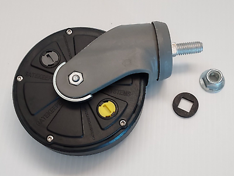


## (8KHz Operation)


### Unlocking and Locking Mechanism (8khz_unlock_lock)

This section showcases a practical example of Lock and Unlock signals that can be emitted through a speaker placed near the wheel. The signals were recorded with a custom-built Very Low Frequency (VLF) loop antenna. More details about loop antennas can be found [here](https://en.wikipedia.org/wiki/Loop_antenna).

The universally applied lock/unlock codes for GateKeeper's Smart Wheels are:

```
Lock Code: 10001110 (Hexadecimal: 0x8E)
Unlock Code: 01110001 (Hexadecimal: 0x71)
```

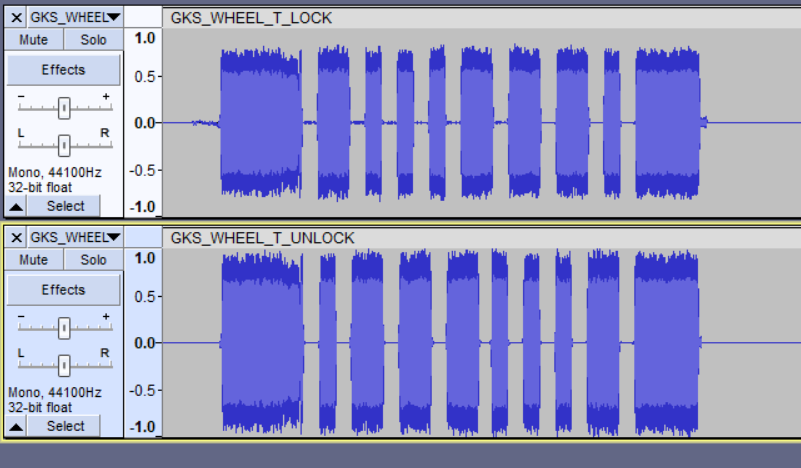

You can find a reference to this in the firmware:
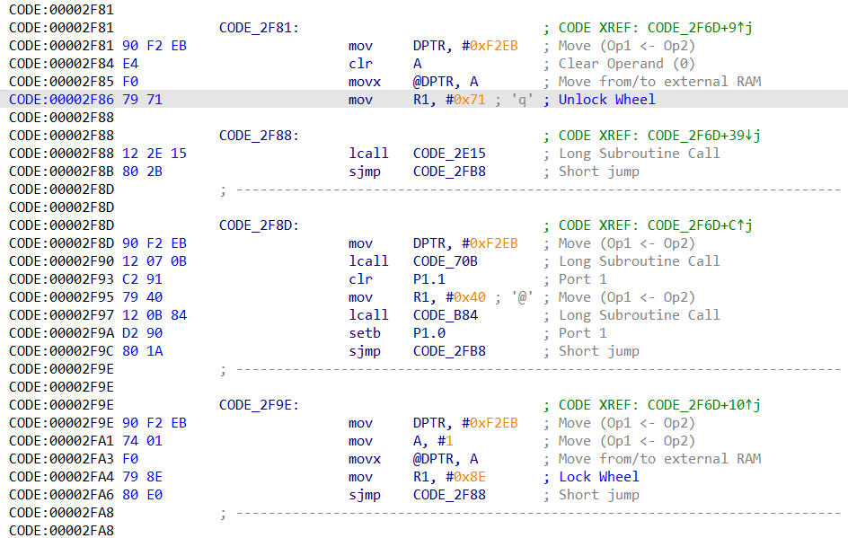

Through some brute-forcing (which I will speak about in my [blog](https://cra0.net)) I have also discovered an alternative lock and unlock which is used by stores such as [TJ Maxx](https://tjmaxx.tjx.com/).

```
Lock2 Code: 11000111 (Hexadecimal: 0xC7)
Unlock2 Code: 1111000 (Hexadecimal: 0x78)
```

Older Gatekeeper System wheels also have their own lock signal that isn't in the form of the typical packet shown above. Instead its a constant stream of blips like so:

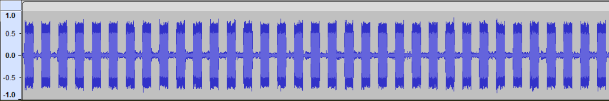

### Device Information Query

Through the usage of one of the Key tools I also discovered this specific 8khz signal that is sent to the smart wheel.

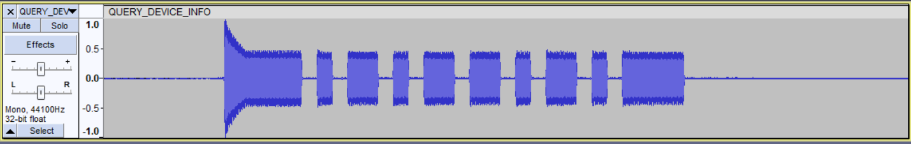

BIN: `1011010`
HEX: `0x5A`

Once the wheel receives this it will then return back statistical information including:

- Battery voltage e.g. (3.0v)
- Cycle Count (How many times it was locked/unlocked)
- date e.g. (09.19) (Manufactory date perhaps?)
- rL e.g. (7.10)
- id1 e.g. (0921)
- id2 e.g. (2358)


This data can also be sent from the wheel via the 2.4GHz signal.

## (2.4GHz Operation)

The smart wheels also support 2.4GHz functionality. In the past it was mentioned [by Joseph Gabay at DEFCON](https://youtu.be/fBICDODmCPI?t=1540) that the wheel can be unlocked
using 2.4GHz and there is likely no locking functionality at this range. It was suggested that it could be built this way by design.

However I have discovered there is in fact the ability to lock at range. Using a HackRF and an extended 2.4GHZ antenna I was able to lock carts around 10-15 meters away.

At 2.4GHz we also have the ability to send some permission commands to the smart wheel such as:

- Dwell Command
    - 10 sec dwell
    - 20 sec dwell
    - 30 sec dwell
    - 60 sec dwell
    - 2 rotations of the wheel
    - 4 rotations of the wheel
    - 8 rotations of the wheel
    - 250 rotations
    - 10 min permission
    - 30 min permission
    - 1 hr permission
    - 3 hr permission
    - E Disarm 1
    - E Disarm 2

- Instant Command
    - 30 Sec permission
    - 1 min permission
    - 2 min permission
    - 5 min permission
    - 10 min permission
    - 30 min permission
    - 1 hr permission
    - 3 hr permission
    - 12 hr permission
    - AP Unlock
    - AP Lock
    - E Arm
    - E Lock
    - Clear
    - E Disarm 1
    - E Disarm 2

These are yet to be explored further but there are transceivers that I have confirmed GateKeeper Systems have in place that talk to the Smart Wheel as evident by this screenshot in this manual:
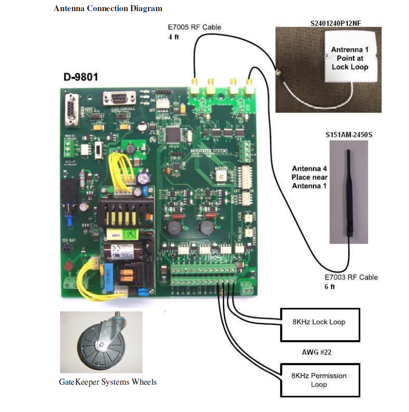

## SOC (MCU)

### ATMEL MEGA

Older builds would use `ATMEL MEGA 168PA`

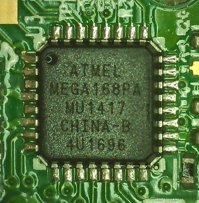

### chip-cc2510-F32

The newer smart wheels use a TI CC2510 chip.

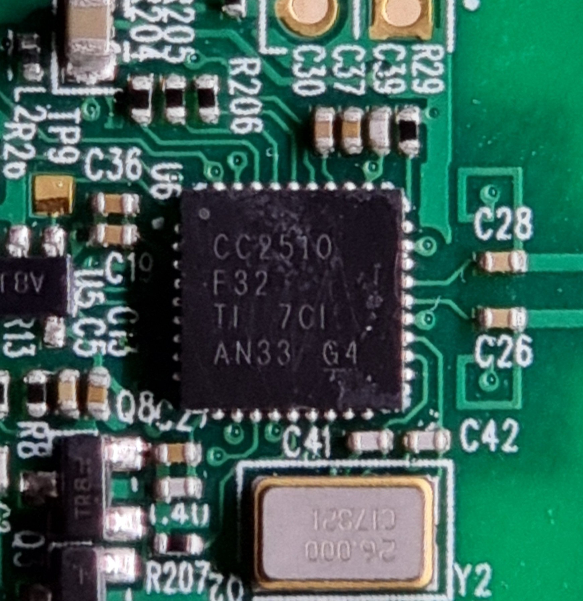
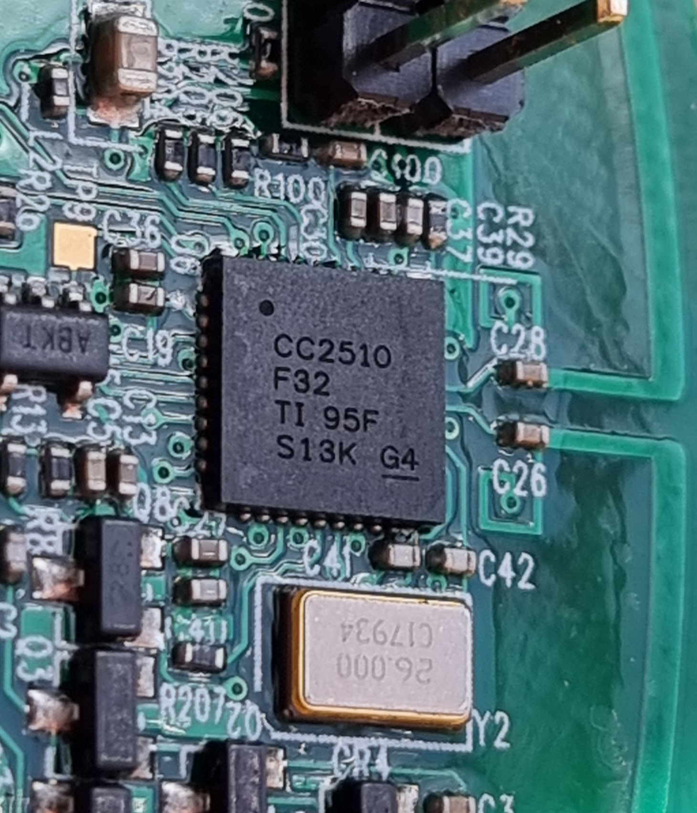

Here is the pinout illustrated:
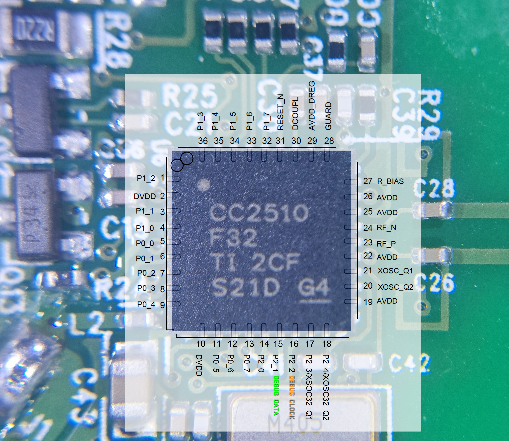

Firmware has been successfully extracted using the [TI CC Debugger tool](https://www.ti.com/tool/CC-DEBUGGER)
I will write a blog post later around this topic.

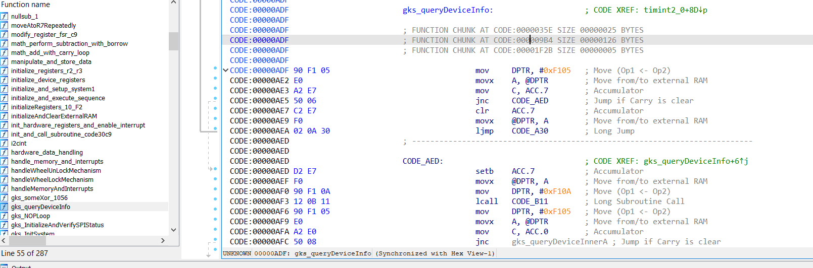


RevN Unfortunately has a DEBUG_READ lock and possibly I will need to follow something [similar to this blog post](https://zeus.ugent.be/blog/22-23/reverse_engineering_epaper/) to get it's memory dumped out.

## Futhernotes

As it stands, the repository's contents are foundational. The goal moving forward is to uncover additional embedded functionalities within the firmware that extend beyond basic [replay attack](https://en.wikipedia.org/wiki/Replay_attack).

If you wish to help contribute or discuss anything feel free to get in touch.

## References

1. [Texas Instruments CC2510 Product Page](https://www.ti.com/product/CC2510)
2. [Denial of Shopping - Exploiting Shopping Cart Immobilization Systems, DEF CON 29 Presentation](https://infocon.org/cons/DEF%20CON/DEF%20CON%2029/DEF%20CON%2029%20presentations/Joseph%20Gabay%20-%20Dos-%20Denial%20of%20Shopping%20%E2%80%93%20Analyzing%20and%20Exploiting%20(Physical)%20Shopping%20Cart%20Immobilization%20Systems.pdf)
3. [Consumer B-Gone](https://www.tmplab.org/2008/06/18/consumer-b-gone/)
4. [How GateKeeper Systems Work (Archived)](https://web.archive.org/web/20170504023929/http://www.gatekeepersystems.com/sol_cc_cc_how_it_works.php)
5. [Gatekeeper Systems (HK) Ltd. FCC Wireless Applications](https://fccid.io/W3Z)