# GateKeeper Systems Smart Wheel Reversing

## About

This repository houses the results from an initial reverse engineering effort focused on the smart wheel used by various supermarkets. This is purely for research and education on how embedded devices work. I have intensionally not included any firmware dumps in this repo to avoid issues with copyright.

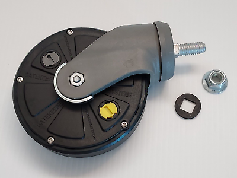

## (8KHz Operation)

### Unlocking and Locking Mechanism (8khz_unlock_lock)

This section showcases a practical example of Lock and Unlock signals that can be emitted through a speaker placed near the wheel. The signals were recorded with a custom-built Very Low Frequency (VLF) loop antenna. More details about loop antennas can be found [here](https://en.wikipedia.org/wiki/Loop_antenna).

The universally applied lock/unlock codes for GateKeeper's Smart Wheels are:

```
Lock Code: 10001110 (Hexadecimal: 0x8E)
Unlock Code: 01110001 (Hexadecimal: 0x71)
```

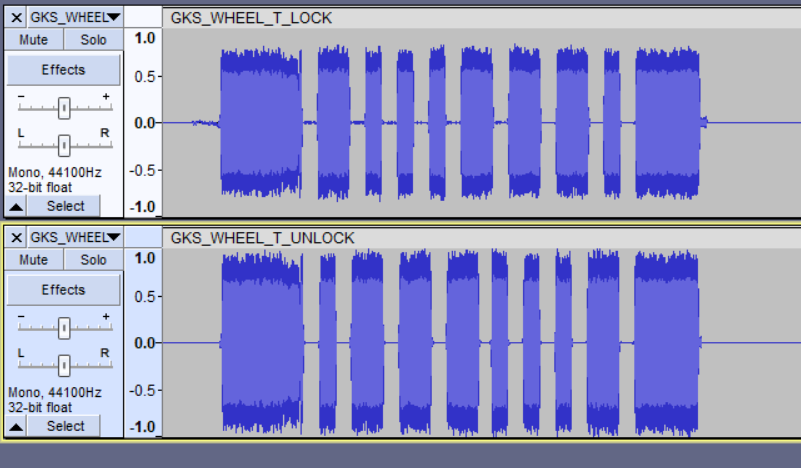

You can find a reference to this in the firmware:
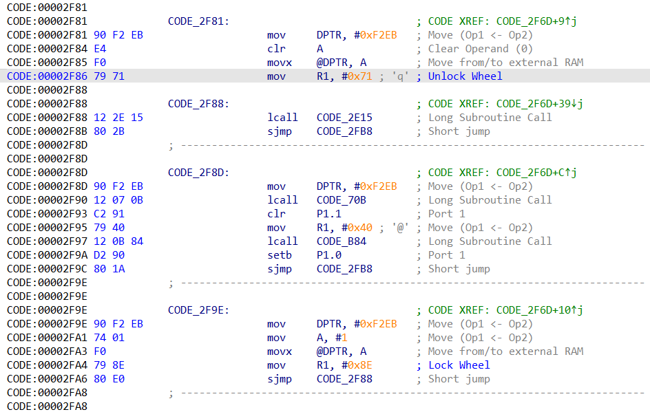

Through some brute-forcing (which I will speak about in my [blog](https://cra0.net)) I have also discovered an alternative lock and unlock which is used by stores such as [TJ Maxx](https://tjmaxx.tjx.com/). This lock seems to be tied to the [Purchek](https://www.gatekeepersystems.com/solutions/purchek/) system as it triggers the smart wheel to send out a packet to activate an alarm and start the surveillance DVR to record for a brief moment.

```
Lock2 Code: 11000111 (Hexadecimal: 0xC7)
Unlock2 Code: 1111000 (Hexadecimal: 0x78)
```

Older Gatekeeper System wheels also have their own lock signal that isn't in the form of the typical packet shown above. Instead its a constant stream of blips like so:

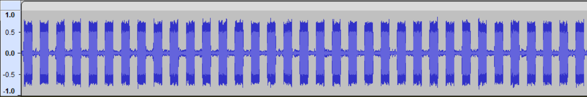

### Device Information Query

Through the usage of one of the 'smart key' tools I also discovered this specific 8khz signal that is sent to the smart wheel.

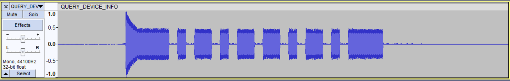

BIN: `1011010`
HEX: `0x5A`

Once the wheel receives this it will then return back statistical information including:

- Battery voltage e.g. (3.0v)
- Cycle Count (How many times it was locked/unlocked)
- date e.g. (09.19) (Manufactory date or 'BornDate')
- rL e.g. (7.10) (Firmware Version)
- id1 e.g. (0921)
- id2 e.g. (2358)

This data can also be sent from the wheel via the 2.4GHz radio.

### Permission Signal

In the current implementation devices such as the indoor/door manager have terminals to run a loop wire for permission
related operations.

So far the ones I've discovered through the brute force of the DIP switch are:

```c
0x34, // Permission (1min)   (binary 00110100, decimal: 52)
0x36, // Permission (5min)   (binary 00110110, decimal: 54)
0x3A, // Permission (2min)   (binary 00111010, decimal: 58)
0x56, // Permission (30secs) (binary 01010110, decimal: 86)
```

These give the smart wheel permission not to lock if it was to encounter a lock command such as 0x8E (Lock1) or 0xC7 (Lock2).

You can find [tools](tools/README.md) I've developed here that deal with these VLF signals in more detail.

## All 8KHz Codes

Below are the complete list of 8 kHz signal codes I’ve discovered so far. A condensed subset of these appears on the label on the back of the **Smart Key 2**. This table also shows you the 8Khz packet values discovered.

| Code | Description                  | 8KHZ Code |
|------|------------------------------|-----------|
| 0    | Idle                         | N/A       |
| 2    | E-purchek Door Lock          | 0xA5      |
| 3    | Lock                         | 0x8E      |
| 4    | Indoor Unlock                | 0x78      |
| 5    | Indoor Lock                  | 0x85      |
| 6    | Unlock                       | 0x71      |
| 9    | 30 Second Permission         | 0x56      |
| 10   | 10 Minute Permission         | 0x50      |
| 11   | 30 Minute Permission         | 0x4F      |
| 12   | 1 Hour Permission            | 0x4A      |
| 13   | 3 Hour Permission            | 0x45      |
| 14   | 12 Hour Permission           | 0x40      |
| 15   | 2 Minute Permission          | 0x3A      |
| 16   | 5 Minute Permission          | 0x36      |
| 17   | 1 Minute Permission          | 0x34      |
| 18   | Restore Permission           | 0x1A      |
| 19   | CARTTRONICS Lock             | N/A       |
| 20   | CARTTRONICS UNLock           | N/A       |
| 21   | E-purchek Surveillance       | 0xC4      |
| 22   | S-purchek Surveillance       | 0xB3      |
| 23   | S-purchek Door Lock          | 0x55      |
| 24   | Clear Permissions            | 0x9A      |
| 25   | E-purchek Arm 1              | 0xA8      |
| 26   | E-purchek Disarm 1           | 0xC9      |
| 27   | S-purchek Alt Door Lock      | 0xC7      |
| 28   | E-purchek Disarm 2           | 0xBD      |
| 29   | E-purchek Arm 2              | 0xA6      |
| 82   | Athena Logging Door 0        | 0x20      |
| 83   | Athena Locking Door 0        | 0x99      |
| 84   | Athena Logging Door 1        | 0x43      |
| 85   | Athena Locking Door 1        | 0x2F      |
| 86   | Athena Logging Door 2        | 0xB0      |
| 87   | Athena Locking Door 2        | 0xBE      |
| 88   | Athena Logging Door 3        | 0x67      |
| 89   | Athena Locking Door 3        | 0x6C      |
| 90   | Athena Kill Nav              | 0xDC      |
| 91   | Athena Future Use            | 0x02      |
| 92   | S-purchek Surveillance A     | 0x7D      |
| 93   | S-purchek Door Lock A        | 0x62      |
| 94   | S-purchek Surveillance B     | 0x96      |
| 95   | S-purchek Door Lock B        | 0x29      |
| 96   | S-purchek Surveillance C     | 0x8B      |
| 97   | S-purchek Door Lock C        | 0x1F      |
| 98   | S-purchek Surveillance D     | 0x82      |
| 99   | S-purchek Door Lock D        | 0x1C      |
| 52   | Dwell SCO Entry – 30 Sec     | 0x7E      |
| 53   | Dwell SCO Entry – 1 Min      | 0x7B      |
| 30   | Dwell SCO Exit               | 0x23      |

## (2.4GHz Operation)

The smart wheels also support 2.4GHz functionality. In the past it was mentioned [by Joseph Gabay at DEFCON](https://youtu.be/fBICDODmCPI?t=1540) that the wheel can be unlocked
using 2.4GHz and there is likely no locking functionality at this range. It was suggested that it could be built this way by design.

However I have discovered there is in fact the ability to lock at range. Using a HackRF and an extended 2.4GHZ antenna I was able to lock carts around 10-15 meters away.

At 2.4GHz we also have the ability to send some permission commands to the smart wheel such as:

- Dwell Command
    - 10 sec dwell
    - 20 sec dwell
    - 30 sec dwell
    - 60 sec dwell
    - 2 rotations of the wheel
    - 4 rotations of the wheel
    - 8 rotations of the wheel
    - 250 rotations
    - 10 min permission
    - 30 min permission
    - 1 hr permission
    - 3 hr permission
    - E Disarm 1
    - E Disarm 2

- Instant Command
    - 30 Sec permission
    - 1 min permission
    - 2 min permission
    - 5 min permission
    - 10 min permission
    - 30 min permission
    - 1 hr permission
    - 3 hr permission
    - 12 hr permission
    - AP Unlock
    - AP Lock
    - E Arm
    - E Lock
    - Clear
    - E Disarm 1
    - E Disarm 2

These are yet to be explored further but there are transceivers that I have confirmed GateKeeper Systems have in place that talk to the Smart Wheel as evident by this screenshot in this manual:
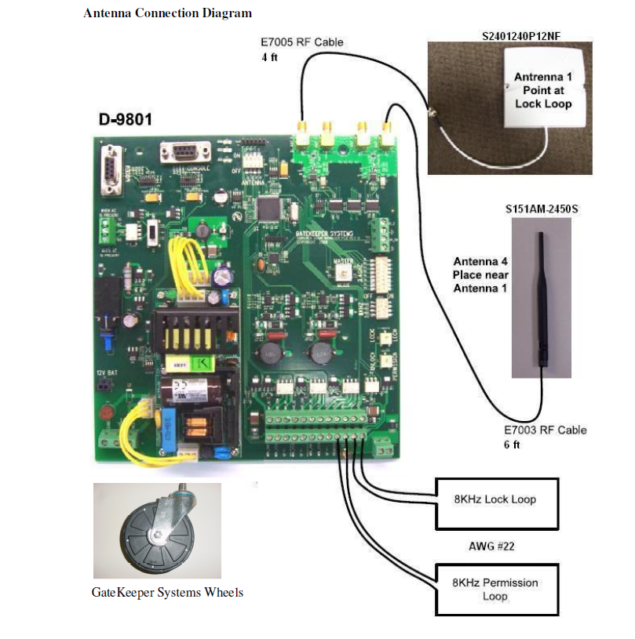

## Door Manager

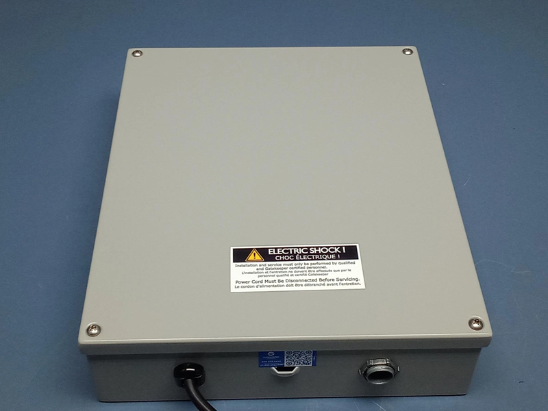

The Door Manager is the hardware that manages GKS wheels which are retailed in a store/location. It can provide 2.4 GHz and 8 kHz functionality and basically acts like a controller to manage activity through a passageway or area in the store.

It consists of two 8 kHz loop connectors that can be configured from the default (permission/lock) to support many different functions.

The Door Manager can log events such as Purchek alarms and surveillance events. When an event occurs, it records:

- Time-Stamp
- DeviceId
- St (Status: LK/UNL)
- Cycs (Cycle count)
- BornDate (Manufacture date)
- Cst
- STH
- Bat (Battery Level eg. 3.0v)
- FrmwV (Firmware Version)
- Hw (eg FE)
- Btl
- WDR
- PairedID
- FL
- DvS
- 20S
- Chn
- AS
- Ant
- TSLP


## SOC (MCU)

### ATMEL MEGA

Older builds would use `ATMEL MEGA 168PA`

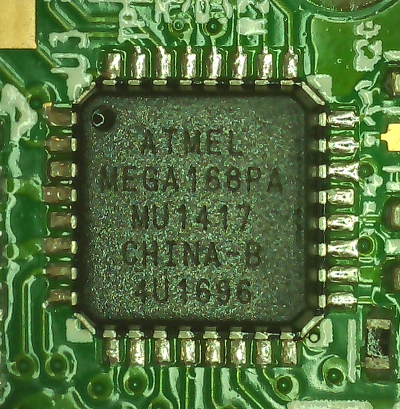

### chip-cc2510-F32

The newer smart wheels use a TI CC2510 chip.

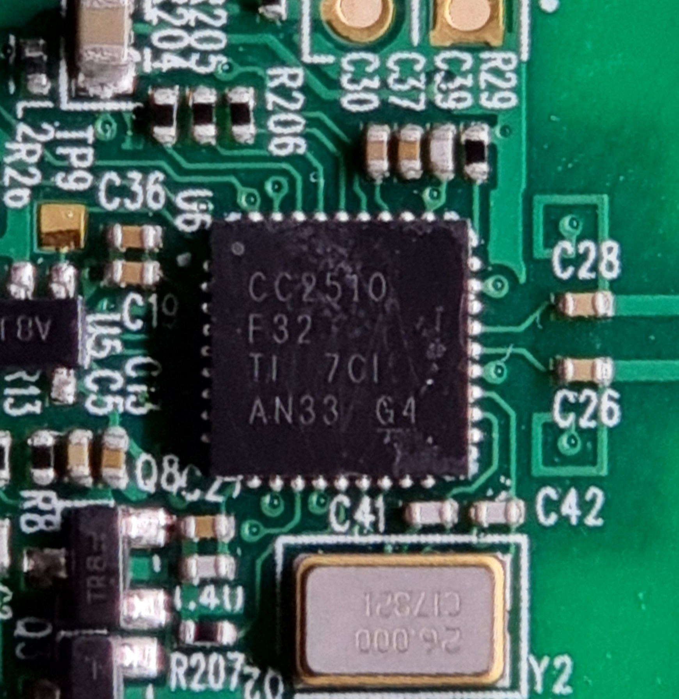
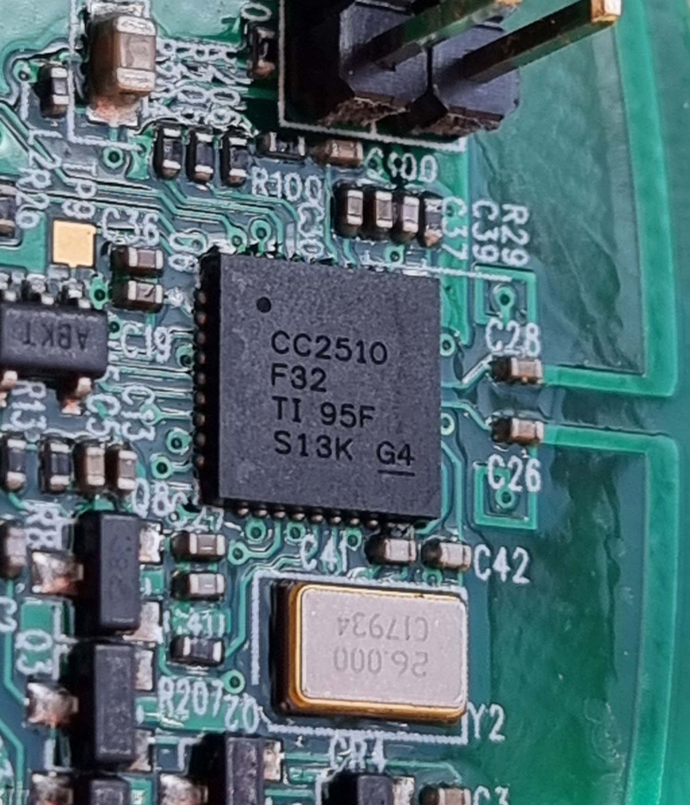

Here is the pinout illustrated:
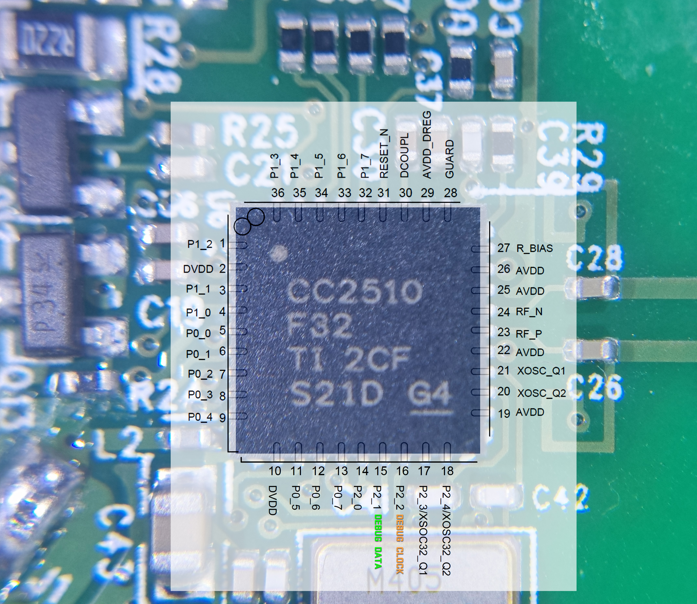

Firmware has been successfully extracted using the [TI CC Debugger tool](https://www.ti.com/tool/CC-DEBUGGER)
I will write a blog post later around this topic.

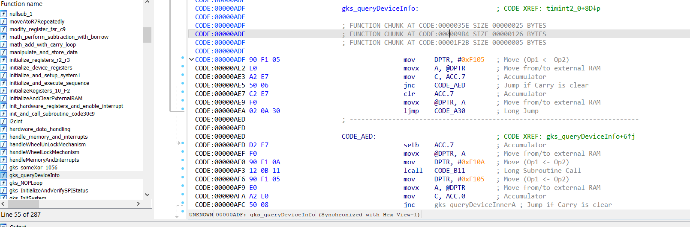


RevN Unfortunately has a DEBUG_READ lock and possibly I will need to follow something [similar to this blog post](https://zeus.ugent.be/blog/22-23/reverse_engineering_epaper/) to get it's memory dumped out.

## Futhernotes

As it stands, the repository's contents are foundational. The goal moving forward is to uncover additional embedded functionalities within the firmware that extend beyond basic [replay attack](https://en.wikipedia.org/wiki/Replay_attack).

If you wish to help contribute or discuss anything feel free to get in touch via email or join our [discord group](https://discord.gg/cVwmnhJgt3).

## References

1. [Texas Instruments CC2510 Product Page](https://www.ti.com/product/CC2510)
2. [Denial of Shopping - Exploiting Shopping Cart Immobilization Systems, DEF CON 29 Presentation](https://infocon.org/cons/DEF%20CON/DEF%20CON%2029/DEF%20CON%2029%20presentations/Joseph%20Gabay%20-%20Dos-%20Denial%20of%20Shopping%20%E2%80%93%20Analyzing%20and%20Exploiting%20(Physical)%20Shopping%20Cart%20Immobilization%20Systems.pdf)
3. [Consumer B-Gone](https://www.tmplab.org/2008/06/18/consumer-b-gone/)
4. [How GateKeeper Systems Work (Archived)](https://web.archive.org/web/20170504023929/http://www.gatekeepersystems.com/sol_cc_cc_how_it_works.php)
5. [Gatekeeper Systems (HK) Ltd. FCC Wireless Applications](https://fccid.io/W3Z)