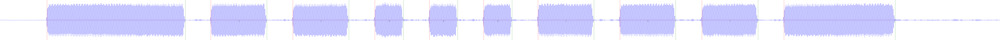

# Tools

This directory contains tools I've developed to help ease understanding/reproducing mechanism utilized by GKS hardware and components.

## VLFLib

VLFLib is a C# Class Library that utilizes [NAudio](https://www.nuget.org/packages/NAudio/) under the hood to provide the ability to quickly decode GateKeeperSystem
[VLF](https://en.wikipedia.org/wiki/Very_low_frequency) signals to their byte representation.

It also has the ability to generate a render visualization of the waveform with the bit representations.

<figure>
    
    <figcaption>An example Lock (0xC7) signal visualized</figcaption>
</figure>

---------------

## VLFSignalTool

VLFSignalTool is a Windows console application that leverages **VLFLib** to encode and decode GateKeeperSystem VLF signals. It supports two modes:

- **`-decode <input.wav>`**  
  Parses an 8-bit mono WAV file containing a VLF signal and outputs a `.bin` file with the raw byte data.
- **`-encode <input.bin>`**  
  Takes a binary file of VLF data and generates a `.wav` file suitable for playback (8-bit mono).

Under the hood, VLFSignalTool instantiates a `VLFSignal` object (from VLFLib) to handle parsing and conversion. Errors and parsing status messages are printed to the console.

### Requirements

- Windows
- An 8-bit mono WAV file for decoding
- A non-empty binary file for encoding

### Usage

```bash
VLFSignalTool -decode <input.wav>
VLFSignalTool -encode <input.bin>
```

#### Examples

```bash
# Decode a WAV file (e.g., sound.wav) to produce sound.bin
VLFSignalTool -decode sound.wav

# Encode a binary file (e.g., data.bin) to produce data.wav
VLFSignalTool -encode data.bin
```
